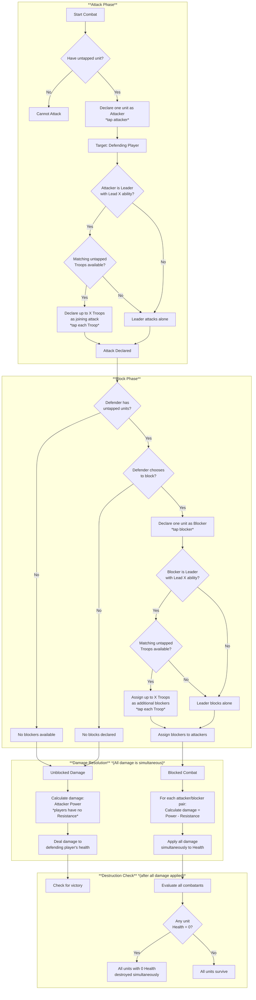
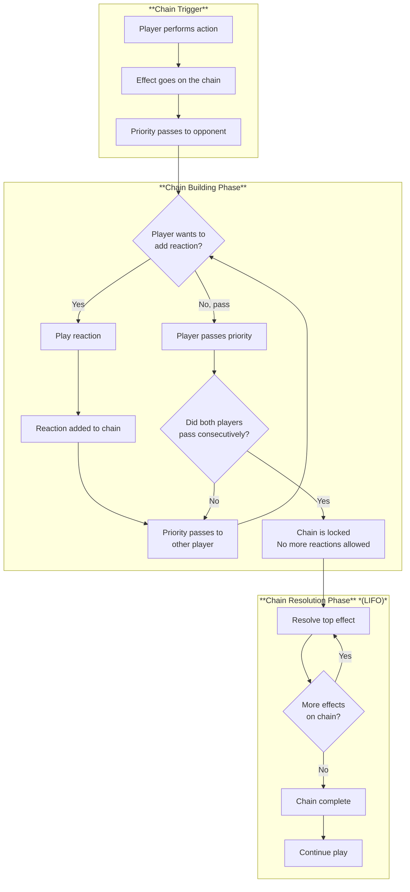

# Lords of Estraven (LOE) — Game Design v2

## Game Setup

- Each player selects two pre-constructed 20-card decks (40 cards total)
- Each player starts with 20 health
- A shared marketplace contains 20 resource cards, with 5 face-up at game start
- First player is determined randomly
- All players draw 7 cards to start

---

## Turn Structure

| Phase     | Actions                                                                            |
| --------- | ---------------------------------------------------------------------------------- |
| **Start** | Untap all your cards; move all pitched cards to graveyard; draw to 7 cards         |
| **Main**  | Play cards, activate abilities, attack, trade in marketplace, pitch cards for mana |
| **End**   | Discard down to 7 cards                                                            |

---

## Actions / Abilities / Effects

### Actions

Actions are game actions a player can take in the game context. For example playing a card or activating a ability of a unit.

### Abilities

Abilities are properties of cards / entities that result in effects. Types of abilities are:

- Activated abilities, noted as: `{cost}: {effect}`
- Reaction abilities, noted as: `@TODO`
- Static abilities, noted as: `@TODO` (which can be conditional)

### Effects

Effects are events that change the game state. For exmaple a being destroyed is a effect. There are two types of effects:

- Chainable effects (before the effect resolves, players have a change to react to the effect)
- Immediate effects (effects resolve before anything else can happen)

## Card Templating

Depending on the card type, a card consists out of:

- Characteristic, for example mana value or power
- Abilities that can result in effects

## Card Types

### Units

Units are cards that enter the battlefield. Only untapped units can attack or block. Units tap when declared as attackers or blockers; units joining an attack or block via the Lead ability also tap when they join.

- Units can attack by tapping
- Units can attack the turn they're played (unless they enter tapped)
- Units can block when untapped
- Units can have multiple subtypes, (e.g. `Unit Leader Zombie`)

All units have three stats:

- **Power**: Offensive strength; determines damage dealt in combat
- **Resistance**: Defensive stat; reduces incoming damage
- **Health**: Life total; when reduced to 0, the unit is destroyed

**Damage Calculation**: Damage dealt = Attacker's Power - Defender's Resistance (minimum 0). Damage reduces Health.

- **Troops**: Typically have 1 Health
- **Leaders**: Can have higher Health values and may possess the `Lead X {UNIT_SUBTYPE}` ability

### Leaders

- Leader is a subtype of Units
- Attack target: **opponent (player) only** — Leaders cannot target other units directly
- Leaders may have the `Lead X {UNIT_SUBTYPE}` ability:
  - When attacking, the Leader can declare up to X untapped Troops of the specified subtype as joining the attack
  - All declared Troops tap when joining the attack
  - When blocking, the Lead ability allows the Leader to assign up to X Troops of the specified subtype as blockers alongside them

### Troops

- Troop is a subtype of Units
- Troops can join a Leader's attack if they match the Leader's `Lead X {UNIT_SUBTYPE}` ability
- Troops can block attacking units (by tapping)
- Can exist on the battlefield without a Leader
- Summoned the same as other cards, or created by effects
- Troops typically have 1 Health

### Spells

- One-time effects that go to the graveyard after resolving
- Played during your main phase

### Reactions

- Reaction speed cards that can be played in response to actions
- Can only be played when:
  - You have priority
  - a chainable effect occurs
  - the reaction ability allows reactions to that type of effect
- When played, reactions are added to the chain and resolve in LIFO order
- Played during either player's turn when conditions are met

---

## Combat

### Overview

Combat is simplified: a player can only attack with one unit per turn (plus additional troops if the attacker has the Lead ability). Defenders can only block with one unit (plus additional troops if blocking with a Leader with the Lead ability). All damage is simultaneous, and units that reach 0 health are destroyed at the same time.

### Attacking

1. **Declare Attacker**: Choose one untapped unit (Leader or Troop) as your attacker and tap it
2. **Declare Target**: The target must be the defending **player** (not another unit)
3. **Lead Ability** (Leaders only): If the attacking Leader has `Lead X {UNIT_SUBTYPE}`, you may declare up to X untapped Troops of that subtype as joining the attack; tap all joining Troops
4. A player may only declare **one unit as attacker per turn** (the Lead ability allows additional Troops to join this single attack)

### Blocking

1. **Declare Blocker**: The defending player may declare one untapped unit as a blocker and tap it; the defending player may choose not to block
2. **One Blocker Rule**: Only one unit can be declared as a blocker, unless blocking with a Leader with the Lead ability
3. **Lead Ability** (Leaders only): If blocking with a Leader that has `Lead X {UNIT_SUBTYPE}`, the defender may assign up to X untapped Troops of that subtype as additional blockers; tap all joining Troops
4. **Assign Blockers**: The defender assigns which blocker blocks which attacking unit; each attacking unit can only be blocked by one blocker

### Damage Resolution

- **All damage is simultaneous**: Calculate all damage first, then apply it, then determine deaths
- **Damage Calculation**: Damage = Attacker's Power - Defender's Resistance (minimum 0)
- Damage reduces the target's Health
- When a unit's Health reaches 0, it is destroyed
- **Simultaneous Deaths**: All units that reach 0 Health are destroyed at the same time, after all damage is applied

### Effect Triggering

- Effects that trigger from declaring attacks or unit deaths **do not start a chain**
- All effects from the **active player** resolve first
- Then effects from other players resolve in **priority order**
- This prevents complex chain interactions during combat

### Combat Flow Chart

---

## Priority and the Chain

The chain mechanism determines how players can respond to actions and how effects resolve. This system is inspired by Yu-Gi-Oh!'s chain mechanism.

### Action Speeds

There are three action speeds in the game:

| Speed                      | Description                                                                             | Can Respond To                                          | Examples                                            |
| -------------------------- | --------------------------------------------------------------------------------------- | ------------------------------------------------------- | --------------------------------------------------- |
| **Normal Speed**           | Actions that can only be played during your main phase when the chain is empty          | N/A - Cannot be used as responses                       | Playing spells, attacking, most activated abilities |
| **Reaction Speed**         | Actions that can respond to normal speed actions and other reactions                    | Normal speed actions, other reactions (if card allows)  | Reaction cards, abilities marked as reactions       |
| **Fast Speed** _(Not MVP)_ | Actions that can respond to normal speed actions, reactions, and other fast speed cards | Normal speed actions, reactions, other fast speed cards | Reserved for future expansion                       |

### Chain Building

1. **Trigger**: A player performs a chain-starting action (see below)
2. **Priority Pass**: After each action, priority passes to the opponent
3. **Response Window**: The player with priority may respond with a reaction speed card/ability
4. **Chain Growth**: If a reaction is played, priority passes again, allowing another response
5. **Chain Lock**: When both players pass consecutively without adding to the chain, no more reactions can be added

### Actions That Start a Chain

The following actions trigger a chain when performed:

- Playing a spell card
- Declaring an attack
- Activating an ability (unless marked as non-chain)
- Playing a unit card
- Using a card effect that targets another card or player

### Actions That Do NOT Start a Chain

The following actions do not trigger a chain and cannot be responded to:

- Pitching cards for mana
- Spending mana from your mana pool
- Drawing cards (unless from an effect)
- Untapping cards during start phase
- Discarding cards during end phase
- Trading in the marketplace

### Chain Resolution

- The chain resolves in **LIFO (Last In, First Out)** order
- Once the chain starts resolving, players cannot add new reactions
- Each effect resolves completely before the next effect resolves
- After the entire chain resolves, play continues normally

### Priority Rules

- The active player (whose turn it is) always receives priority first
- Priority passes to the opponent after each action or effect
- Mana pitched on your turn can be spent on reactions during opponent's turn
- A player may pass priority without taking an action

### Chain Flowchart

---

## Resources

### Pitching for Mana

- Any card can be pitched for its pitch value (1, 2, or 3 mana)
- **Pitch value is printed on the front of the card**
- All cards have a pitch value, though some special cards may have a value of 0
- Pitching can **only be done on your own turn**
- Pitching does **not** start a chain and cannot be responded to
- No limit to how many cards you can pitch per turn
- Mana from pitched cards can be spent on reactions during opponent's turn
- **At the beginning of your next turn**:
  - All pitched cards → graveyard (regardless of whether mana was used)

### Mana Pool

- Unused mana does **not** empty at end of turn or phase
- No mana pool limit
- Mana can be stored between turns

### Resource Cards

- Three types: Subjects, Materials, Influence
- Resource cards **cannot** be pitched for mana
- Sacrifice costs are specified on each card (may require tap, discard, destroy, etc.)

### Deck Depletion

- **Empty deck = you lose**
- Balance mana usage: over-pitching burns through your deck

---

## Marketplace

- **Shared deck**: 20 resource cards, 5 face-up at game start
- **Refresh**: At the start of each round, the oldest card (first revealed) is removed and all cards shift; a new card is added from the resource deck
- **Trade**: Once per turn, swap any card from your hand with any marketplace card (including cards traded in by opponents)
- Cards removed from marketplace and traded cards are shuffled back into the resource deck
- Resource deck does not run out (cards cycle back)
- Cannot view cards in the resource deck
- Reactions to marketplace actions are possible if a reaction card/ability allows it
- Play unlimited resource cards per turn

---

## Win Conditions

### Victory

- Reduce opponent to 0 health

### Loss

- Your health reaches 0
- Your deck is empty (deck depletion)

### Draw

- If both players would lose simultaneously, the game is a draw

---

## Out of MVP Scope

The following features are planned but not included in the MVP:

- Fast speed cards and abilities
- Equipment/attachment cards
- Enchantment/continuous effect cards
- Alternative win conditions
- Mulligan system
- Compensation for going second
- Concede option

---

## Glossary

| Term                      | Definition                                                                                                                                 |
| ------------------------- | ------------------------------------------------------------------------------------------------------------------------------------------ |
| **Activated ability**     | An ability with a cost that can be activated by paying that cost, noted as `{cost}: {effect}`                                              |
| **Battlefield**           | The play area where units exist after being played from hand                                                                               |
| **Block**                 | Declaring a unit to intercept an attacking unit to prevent damage to the defending player                                                  |
| **Chain**                 | A sequence of actions and reactions that resolve in LIFO order; once locked, no more effects can be added                                  |
| **Chain lock**            | The state when both players have passed priority consecutively, sealing the chain for resolution                                           |
| **Deck**                  | A player's draw pile; running out means you lose                                                                                           |
| **Fast speed**            | _(Not MVP)_ Action speed that can respond to normal speed actions, reactions, and other fast speed cards; reserved for future expansion    |
| **FIFO**                  | First In, First Out — oldest items are removed first                                                                                       |
| **Graveyard**             | Discard pile where used or destroyed cards go                                                                                              |
| **Health**                | A unit's or player's life total; when reduced to 0, the unit is destroyed (or player loses)                                                |
| **Lead X {UNIT_SUBTYPE}** | A Leader ability that allows declaring up to X Troops of the specified subtype when attacking or blocking with that Leader                 |
| **LIFO**                  | Last In, First Out — newest items are resolved first; used for chain resolution                                                            |
| **Mana**                  | Resource used to pay for cards and abilities; generated by pitching                                                                        |
| **Normal speed**          | Actions that can only be played during your main phase when the chain is empty (e.g., spells, attacking)                                   |
| **Pitch**                 | Playing a card on your turn to generate mana equal to its pitch value (1–3); does not start a chain                                        |
| **Pitch value**           | The mana a card produces when pitched (printed on the front as 1, 2, or 3)                                                                 |
| **Power**                 | A unit's offensive strength; determines damage dealt in combat                                                                             |
| **Priority**              | The right to take an action or respond; passes between players after each action                                                           |
| **Priority order**        | The order in which players' effects resolve; active player first, then other players in priority order (determined randomly at game start) |
| **Reaction**              | An action that can respond to normal speed actions or other reactions when you have priority                                               |
| **Reaction speed**        | Action speed that can respond to normal speed actions and other reactions                                                                  |
| **Resistance**            | A unit's defensive stat; reduces incoming damage (damage = Power - Resistance)                                                             |
| **Round**                 | A complete cycle where all players have taken one turn                                                                                     |
| **Simultaneous damage**   | All combat damage is calculated and applied at the same time; deaths occur after all damage is resolved                                    |
| **Spell**                 | A one-time effect card that goes to graveyard after resolving                                                                              |
| **Tap**                   | Turning a card sideways to indicate it has been used this turn; tapped units cannot attack or block                                        |
| **Triggered ability**     | An ability that automatically triggers when a specific condition is met                                                                    |
| **Turn**                  | One player's complete sequence of phases (Start → Main → End)                                                                              |
| **Untap**                 | Returning a tapped card to upright position, making it usable again                                                                        |
