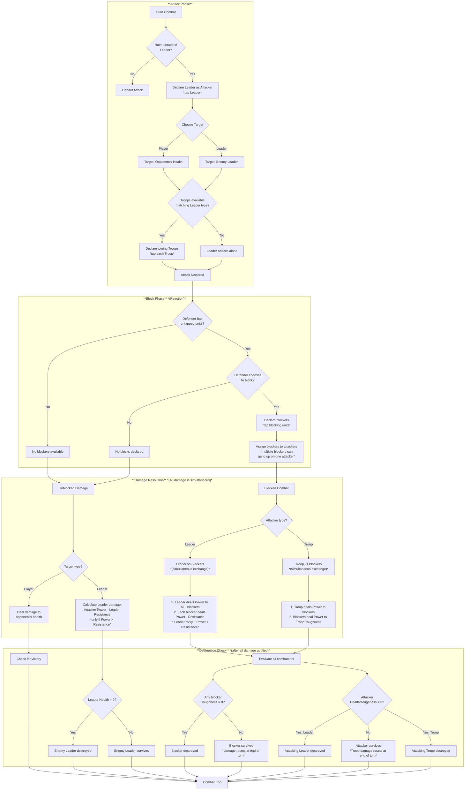
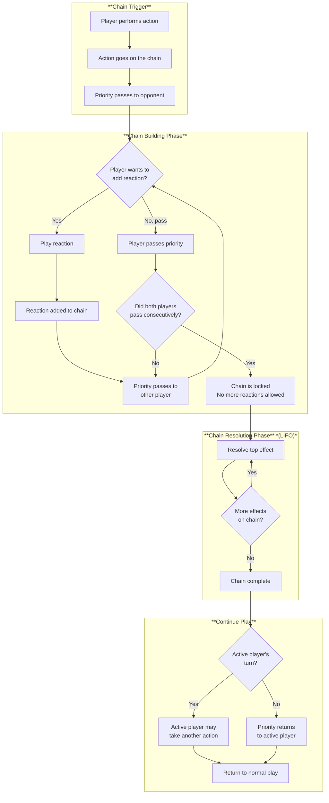

# Lords of Estraven (LOE) — Game Design v2

## Game Setup

- Each player selects two pre-constructed 20-card decks (40 cards total)
- Each player starts with 20 health
- A shared marketplace contains 20 resource cards, with 5 face-up at game start
- First player is determined randomly
- All players draw 7 cards to start

---

## Turn Structure

| Phase | Actions |
|-------|---------|
| **Start** | Untap all your cards; handle pitched cards (partially used → discard, unused → return to hand and deal 1 damage); draw to 7 cards |
| **Main** | Play cards, activate abilities, attack, trade in marketplace |
| **End** | Discard down to 7 cards; troop damage resets |

---

## Card Types

### Units

Units are cards that enter the battlefield. All units can block by tapping. Only untapped units can attack or block. Units tap when attacking or blocking.

#### Unit Stats

- **Troops**: Power / Toughness
  - When Toughness reaches zero, unit is destroyed
  - Damage resets at end of turn
- **Leaders**: Power / Resistance / Health
  - Takes damage equal to (attacker's Power - Leader's Resistance)
  - Only takes damage when attacker's Power exceeds Resistance
  - When Health reaches zero, unit is destroyed
  - Damage is permanent (can be healed by effects)

### Leaders

- Only **one Leader** may attack per turn (by tapping)
- Leaders can attack the turn they're played (unless they enter tapped)
- Attack target: opponent's health **or** another Leader
- Leaders deal damage equal to their Power to **all** blockers (no assigning damage individually)
- Keyword `Leader - {Troop type}` defines which troop types can join attacks
- No maximum number of Troops that can join a Leader's attack (unless specified by abilities)
- Leaders can have triggered and activated abilities with costs, noted as: `{cost}: {effect}`

### Troops

- Join an attacking Leader by tapping (must match Leader's troop type)
- Block attacking units as a reaction (by tapping)
- Can exist on the battlefield without a Leader
- Summoned the same as other cards, or created by effects
- Multiple blockers can gang up on a single attacking Troop

### Spells

- One-time effects that go to the graveyard after resolving
- Played during your main phase

### Reactions

- Reaction speed cards that can be played in response to actions
- Can only be played when you have priority and a triggerable event occurs
- Each reaction card specifies what events it can respond to
- When played, reactions are added to the chain and resolve in LIFO order
- Played during either player's turn when conditions are met

---

## Combat

### Attacking

1. Declare one untapped Leader as attacker (tap it)
2. Choose target: opponent or enemy Leader
3. Untapped Troops matching the Leader's type may join (they tap)
4. A Leader can attack without any Troops joining

### Blocking

- Blocking is a **reaction**
- Any untapped unit may block by tapping
- Multiple blockers can gang up on one attacker
- Troops can block without a Leader on the battlefield
- You can choose not to block
- Leaders can have abilities that limit the number of blockers

### Damage Resolution

- All damage happens simultaneously, then destroyed units are determined
- **Leader vs Blockers**: Leader deals damage equal to its Power to all blockers; blockers deal damage to Leader equal to (blocker's Power minus Leader's Resistance), but only when blocker's Power exceeds Leader's Resistance
- **Troop vs Blockers**: Compare Power vs Toughness
- Excess damage: When Power is greater than Toughness (for Troops), excess damage does not apply to Leaders (player takes no damage from combat with Leaders)
- When a Leader attacks but is blocked, combat functions the same as if Troops joined

### Combat Flow Chart

---

## Priority and the Chain

The chain mechanism determines how players can respond to actions and how effects resolve. This system is inspired by Yu-Gi-Oh!'s chain mechanism.

### Action Speeds

There are three action speeds in the game:

| Speed | Description | Can Respond To | Examples |
|-------|-------------|----------------|----------|
| **Normal Speed** | Actions that can only be played during your main phase when the chain is empty | N/A - Cannot be used as responses | Playing spells, attacking, most activated abilities |
| **Reaction Speed** | Actions that can respond to normal speed actions and other reactions | Normal speed actions, other reactions (if card allows) | Reaction cards, abilities marked as reactions |
| **Fast Speed** *(Not MVP)* | Actions that can respond to reactions | Reactions, other fast speed cards | Reserved for future expansion |

### Chain Building

1. **Trigger**: A player performs a normal speed action (e.g., plays a spell, declares an attack)
2. **Priority Pass**: After each action, priority passes to the opponent
3. **Response Window**: The player with priority may respond with a reaction speed card/ability
4. **Chain Growth**: If a reaction is played, priority passes again, allowing another response
5. **Chain Lock**: When both players pass consecutively without adding to the chain, no more reactions can be added

### Chain Resolution

- The chain resolves in **LIFO (Last In, First Out)** order
- Once the chain starts resolving, players cannot add new reactions
- Each effect resolves completely before the next effect resolves
- After the entire chain resolves, play continues normally

### Priority Rules

- The active player (whose turn it is) always receives priority first
- Priority passes to the opponent after each action or effect
- You can pitch cards during opponent's turn to pay for reactions
- A player may pass priority without taking an action

### Chain Flowchart

---

## Resources

### Pitching for Mana

- Any card can be pitched for its pitch value (1, 2, or 3 mana)
- **Pitch value is printed on the front of the card**
- All cards have a pitch value, though some special cards may have a value of 0
- Pitching is **reaction speed** — can be done anytime you have priority
- No limit to how many cards you can pitch per turn
- Can pitch cards in response to opponent actions
- **At the beginning of your turn**:
  - Partially used pitched cards → graveyard
  - Unused pitched cards → return to hand and deal 1 damage to you

### Mana Pool

- Unused mana does **not** empty at end of turn or phase
- No mana pool limit
- Mana can be stored between turns

### Resource Cards

- Three types: Subjects, Materials, Influence
- Resource cards **cannot** be pitched for mana
- Sacrifice costs are specified on each card (may require tap, discard, destroy, etc.)

### Deck Depletion

- **Empty deck = you lose**
- Balance mana usage: over-pitching burns through your deck

---

## Marketplace

- **Shared deck**: 20 resource cards, 5 face-up at game start
- **Refresh**: At the start of each round, the oldest card (first revealed) is removed and all cards shift; a new card is added from the resource deck
- **Trade**: Once per turn, swap any card from your hand with any marketplace card (including cards traded in by opponents)
- Cards removed from marketplace and traded cards are shuffled back into the resource deck
- Resource deck does not run out (cards cycle back)
- Cannot view cards in the resource deck
- Reactions to marketplace actions are possible if a reaction card/ability allows it
- Play unlimited resource cards per turn

---

## Win Conditions

### Victory

- Reduce opponent to 0 health

### Loss

- Your health reaches 0
- Your deck is empty (deck depletion)

### Draw

- If both players would lose simultaneously, the game is a draw

---

## Out of MVP Scope

The following features are planned but not included in the MVP:

- Fast speed cards and abilities
- Equipment/attachment cards
- Enchantment/continuous effect cards
- Alternative win conditions
- Mulligan system
- Compensation for going second
- Concede option

---

## Glossary

| Term | Definition |
|------|------------|
| **Activated ability** | An ability with a cost that can be activated by paying that cost, noted as `{cost}: {effect}` |
| **Battlefield** | The play area where units exist after being played from hand |
| **Block** | A reaction where a unit intercepts an attacking unit to prevent damage |
| **Chain** | A sequence of actions and reactions that resolve in LIFO order; once locked, no more effects can be added |
| **Chain lock** | The state when both players have passed priority consecutively, sealing the chain for resolution |
| **Deck** | A player's draw pile; running out means you lose |
| **Fast speed** | *(Not MVP)* Action speed that can respond to reactions; reserved for future expansion |
| **FIFO** | First In, First Out — oldest items are removed first |
| **Graveyard** | Discard pile where used or destroyed cards go |
| **Health** | A player's or Leader's life total; reaching 0 means defeat/destruction |
| **LIFO** | Last In, First Out — newest items are resolved first; used for chain resolution |
| **Mana** | Resource used to pay for cards and abilities; generated by pitching |
| **Normal speed** | Actions that can only be played during your main phase when the chain is empty (e.g., spells, attacking) |
| **Pitch** | Playing a card to generate mana equal to its pitch value (1–3) |
| **Pitch value** | The mana a card produces when pitched (printed on the front as 1, 2, or 3) |
| **Power** | A unit's offensive strength; determines damage dealt in combat |
| **Priority** | The right to take an action or respond; passes between players after each action |
| **Reaction** | An action that can respond to normal speed actions or other reactions when you have priority |
| **Reaction speed** | Action speed that can respond to normal speed actions and other reactions |
| **Resistance** | A Leader's defensive stat; reduces incoming damage (only takes damage when attacker's Power > Resistance) |
| **Round** | A complete cycle where all players have taken one turn |
| **Spell** | A one-time effect card that goes to graveyard after resolving |
| **Tap** | Turning a card sideways to indicate it has been used this turn |
| **Toughness** | A Troop's defensive stat; when reduced to 0, the Troop is destroyed |
| **Triggered ability** | An ability that automatically triggers when a specific condition is met |
| **Turn** | One player's complete sequence of phases (Start → Main → End) |
| **Untap** | Returning a tapped card to upright position, making it usable again |
