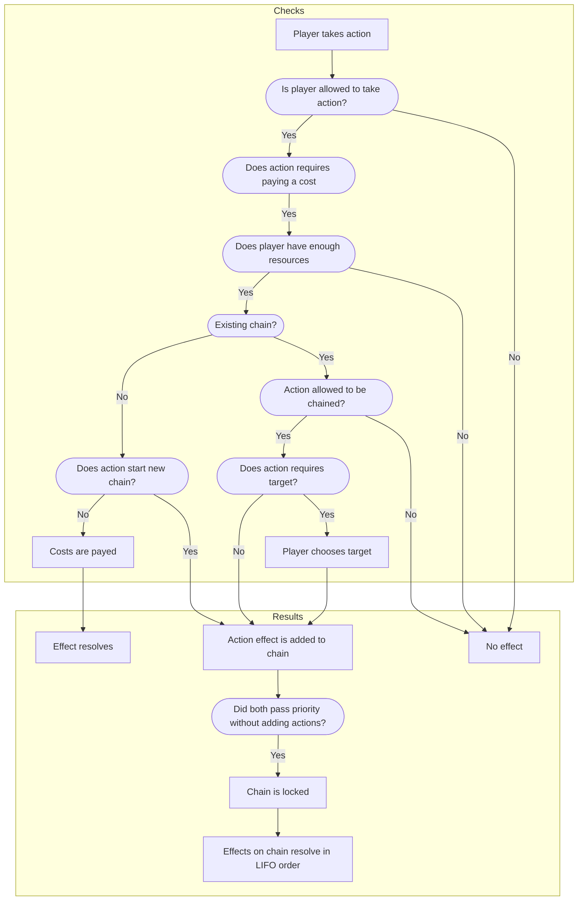

# Taking action and chain flow chart

ACTION types:

- Playing a card
- Activating an ability
- Activating the attack ability
- Passing priority
- End turn

```mermaid
flowchart TD
subgraph Checks

A[Player takes action] --> B([Is player allowed to take action?])
B -->|Yes| C([Does action requires paying a cost])
C -->|Yes| D([Does player have enough resources])
D -->|Yes| E([Existing chain?])
E -->|No| K([Does action start new chain?])
E -->|Yes| F([Action allowed to be chained?])
F -->|Yes| G([Does action requires target?])
G -->|Yes| H[Player chooses target]
K -->|No| P[Costs are payed]

end

subgraph Results
P --> U[Effect resolves]
K -->|Yes| J
G -->|No| J
H --> J[Action effect is added to chain]
J --> T([Did both pass priority without adding actions?])
T -->|Yes| R[Chain is locked]
R --> L[Effects on chain resolve in LIFO order]
F -->|No| END
D -->|No| END
B -->|No| END[No effect]
end

```
